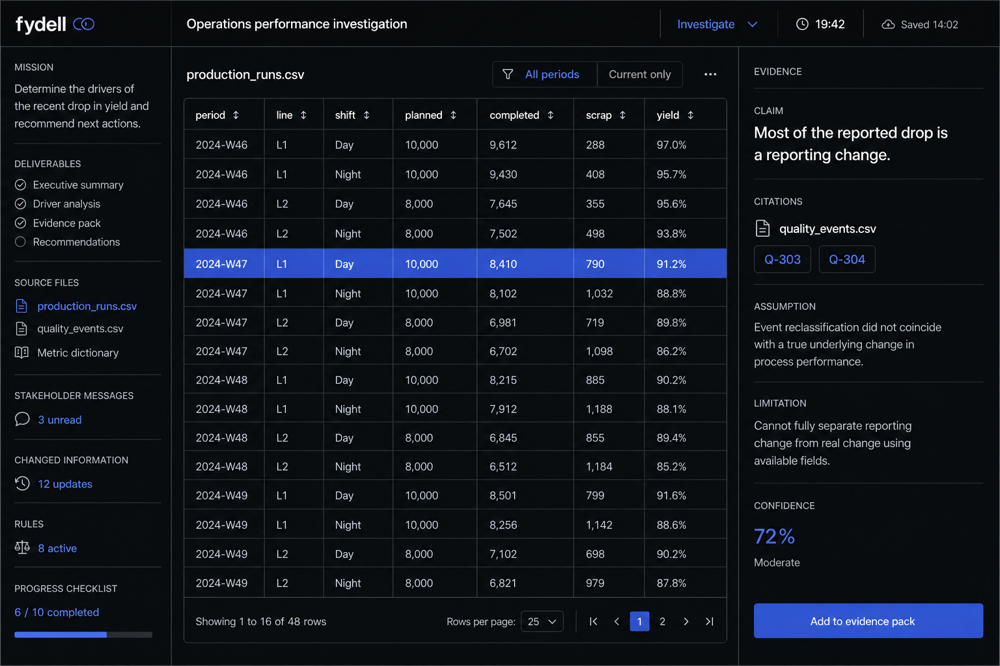
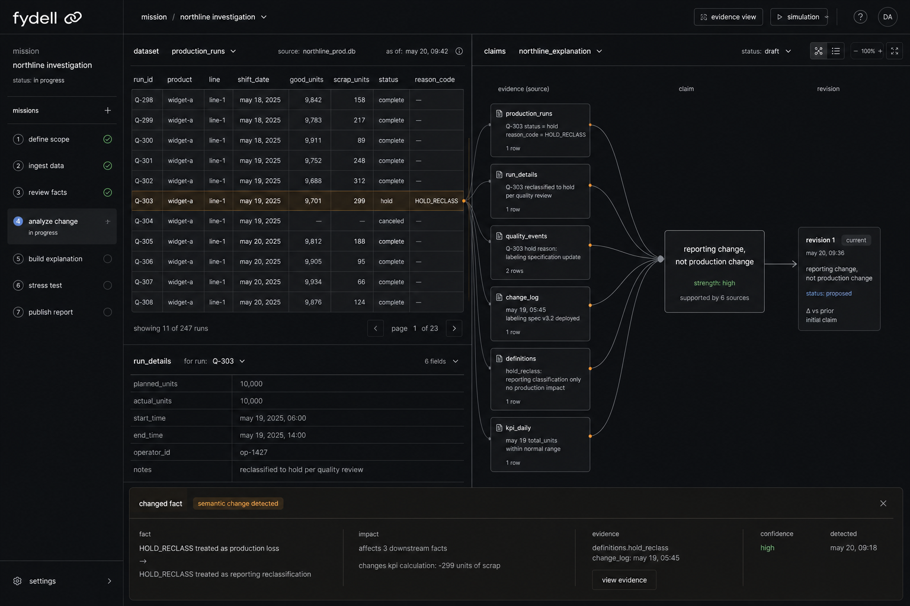
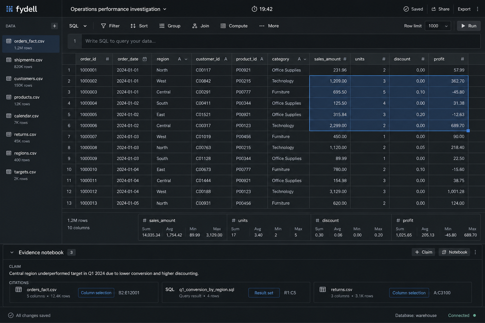

# Visual directions — simulation workbench (Phase 2)

Same populated content target: Northline Components operations-performance investigation, Geist, graphite, exact Fydell mark/wordmark. Comps are **layout intent** only; shipping screenshots must come from code.

Assumptions confirmed by user:
- Chat + local Linear pack are the reference set.
- Visual pass before durable engine persistence.

## Direction A — Dense Linear-discipline shell (RECOMMENDED)

**Rationale:** Stable three-region shell (mission · canvas · evidence) matches how consequential tools earn trust. Evidence stays always visible without turning the product into a diagram toy.

**Linear principle:** Continuous product shell, hairlines, density, one accent for selection/action.

**Distinctly Fydell:** Evidence inspector with claim + citation + assumption/limitation; Northline yield investigation; autosave/timer as real state language.

**Deletes:** Nested marketing frames, stage pills as primary navigation, decorative status chips, uniform 13px type band.

**Interactions:** Mission rail opens sources into canvas; row selection creates citations; inspector edits claims without leaving the shell.

**1280:** Viable if rails compress (~160 / flex / 240) and table keeps horizontal scroll inside canvas only.

## Direction B — Evidence-thread–forward

**Rationale:** Makes source→claim relationships the primary visual. Strong for marketing storytelling and report continuity.

**Linear principle:** Product as proof; clarity through structure.

**Distinctly Fydell:** Explicit thread/thread-adjacent citation stack as the signature.

**Deletes:** Generic notes column; interchangeable card for every concept.

**Risk:** Can become decorative if threads are atmospheric. Must stay calm, selectable, and tied to real rows.

**Interactions:** Selecting a thread focuses source rows and claim; changed-info event recolors only affected edges.

## Direction C — Dataset-first analyst

**Rationale:** Immersion from realistic analysis surface (table + SQL/query). Closest to “feels like the job.”

**Linear principle:** Full canvas for the active tool; chrome stays quiet.

**Distinctly Fydell:** Evidence dock still exists, but secondary until a claim is active.

**Deletes:** Equal three-column weight; oversized stage tabs.

**Interactions:** Range select → “Attach as evidence”; dock expands on claim create; SQL results stay in the same canvas.

**Risk:** Evidence can feel optional if the dock is too weak — fails the product thesis if claims become afterthoughts.

---

## Recommendation

**Choose Direction A.** It best balances immersion (real table work), product thesis (evidence always inspectable), and a system that can expand to report/oral defense without inventing a second visual language. Use Direction C’s dataset density *inside* A’s center canvas, and Direction B’s thread language for marketing diagrams + selected-claim focus states — not as the primary shell.

**Stop gate:** Reply with `A`, `B`, or `C`.  

*Proceeding note:* User asked to complete all plan todos; until an explicit pick arrives, implementation uses **Direction A** as the working contract. An explicit `B`/`C` reply overrides.
